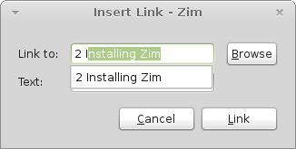

# Basic Features

## Notebooks

Notebooks in Zim are just folders that contain Zim pages, attachments, and folders with more Zim pages.

You can create a Notebook using the "Add" command inside the "Open [Another] Notebook" dialog box by pointing to a new folder you just created or opening an existing folder. Any "`.txt`" files in that folder will be treated as Pages in the Notebook; everything else will be attachments.

TODO: .zim folder and notebook.zim file.

## Page list

By default, Zim shows an Index of all the pages in your notebook in a sidebar on the left side of the window.

To create a new page, you can right-click anywhere in the Index and select "New Page" (for a new top level page) or "New Sub Page" (to create a new child of the selected node). You can also access these commands from the File menu (→ New Page, New Sub Page) or their keyboard shortcuts CTRL+N and CTRL+SHIFT+N.

In the files that make up the Notebook, whenever you create a Sub Page for a page that doesn't have one, a new folder is created with the same name as the parent Page. If you delete or move all the Sub Pages of a parent Page (and that Page also has no attachments) then the folder to contain Sub Pages is also deleted, automatically.

### The Pathbar

Another way to navigate pages is the Pathbar --- the list of Page names above the Page content pane in Zim.

By default the Pathbar lists the pages you most recently visited, with the current page on the right. Click on one of the entries to navigate to that Page. This is the list you traverse when you use the Go Back (ALT+Left) and Go Forward (ALT+Right) commands.

Alternatively, you can choose History in the Pathbar submenu of the View menu. This is like Recent mode, except every visited node is listed strictly in cronological order from left to right, with repeats when you've visited a Page more than once. Think of it as a log file.

You can also choose Namespace mode to show the path of the current Page within the Notebook's structure.

If you don't find any of these lists useful, set the Pathbar mode to None.

## Live Modeless Editing of Pages

One of the best features of Zim which is missing in most other wikis is actually a lack of a feature: There are no separate modes for *reading* and *writing* pages. There is only the one mode which works equally well for reading and writing.

In the page content frame of the Zim interface, you can use the usual editing conventions to move around in the text, edit the text, and follow hyperlinks.

TODO: Move keyboard shortcuts

Here are some keyboard shortcuts for moving around in the text:

| Key | Action |
|--+--|
| CTRL+Up, CTRL+Down | Previous, next paragraph |
| CTRL+Left, CTRL+Right | Previous, next word |
| Home, End | Start, end of line |
| CTRL+Home, CTRL+End | Start, end of page |
| SHIFT+[cursor movement] | Select text |
| CTRL+C, CTRL+X, CTRL+V | Copy, cut, paste selected text |
| Enter | Follow a hyperlink |
| ALT+Left, ALT+Right | Previous, next page in navigation history |
| ALT+PageUp, ALT+PageDown | Previous, next page in page index |
| Enter | Insert a newline (twice for a paragraph) if cursor is not inside a hyperlink |
| SHIFT+Enter | Always insert a newline (twice for a paragraph) |
| CTRL+I, CTRL+B, CTRL+U, CTRL+K | *Italic*, **bold**, <u>highlight</u>, <s>strikethrough</s>
| CTRL+L | Insert hyperlink |
| CTRL+J | Jump to Page by name |

## Text Formatting

Zim supports supports some basic text formatting:

Character styles
  ~ CTRL+I, CTRL+B, CTRL+U, and CTRL+K mark text as italic, bold, highlighted, and strikethrough respectively.
Bulleted lists
  ~ Start a bulleted list with an asterisk followed by a space ("\* ") and the asterisk will become a bullet. Start a new item in the same list by hitting ENTER. Finish the list by hitting ENTER twice.
Numbered lists
  ~ Start a numbered list with "1" followed by a space ("1 "). Start a new item in the same list by hitting ENTER. Finish the list by hitting ENTER twice. 

Bulleted and numbered lists can have sub-lists inside them. Just use Tab and SHIFT+Tab to indent and unindent list items.

## Links

One of the most important features of wikis is the ability to easily insert Links to other topics directly in the context they are needed, instead of relying only on a topic index. Zim allows you to make any selected text in a Page a Link to another Page in the Notebook or to any URL or file outside of the Notebook.

The Insert Link (CTRL+L) command in the Insert menu allows you to insert any kind of link (internal or external). You can type a Page name in the current Notebook in the Link To field and it will help you by autocompleting it.

\ 

The "Browse" button in the "Insert Link" dialog box allows you to browse the filesystem interactively to make a link to a local or remote Windows/Samba-shared file.

Zim has a number of differnet formats for Links listed in the Zim Manual for various kinds of relative and absolute links within the current Notebook, and for other resources that are external to the Notebook, but it's not necessary to memorize these rules up front when you're learning Zim. Use drag-and-drop for most hyperlinks until you find yourself making a lot of the same *kind* of Link; then if you want to learn to type the links quicker, right-click on an existing Link and Edit Properties to see what it looks like. Here are the simplest ways for making most kinds of Links:

A Page in the current notebook
  ~ Without clicking on any Page names in Zim's Index pane (which would navigate to that Page), expand the tree until you find the target, and then click and drag the target Page into the text of the Page where you want to make the Link. Right-click on the new Link and Edit Properties as needed if you want to change the title.
A local file outside the Notebook or a Windows/Samba shared file
  ~ Find the file in your desktop's file manager and drag it to into the text of the Zim Page where you want to Link to it.
Internet/local network resource
  ~ Paste the URL directly into the page. Or type a link title and select it, then hit CTRL+L and paste the URL into the Link To field.

Astute readers might notice that links to local files stored outside the Notebook **might not be portable** when you move or share your Notebook among more than one computer or user. A "Link" in Zim does not copy or cache anything; it is only a *reference* to a target.

TODO: See sectionon Interwiki links

## Attachments

Whereas Links only make a reference to another Page in the Notebook or some other resource, the Attach File command in the Tools menu make a fresh physical copy of the file you choose as a new file within the Notebook.

As with Sub Pages, Attachments are stored in a folder in the Notebook with the same name as the parent Page of the Attachment.

Watch out for orphaned attachments. Zim does not automatically clean up attached files if you delete the last Link pointing to the Attachment. The easiest way to check for orphans on Page is to enable the Attachment Browser plugin; it creates a tab in the Index page that shows all attachments of the current Page, whether they have a link pointing to them or not.

## Find and Replace

Like any other good text editor, Zim has a command to Find (CTRL+F) or Replace (CTRL+H) text within the current Page. On a long page, the Find command is easiest way to quickly find a section you want to read or edit.

TIP: The Replace command optionally supports the use of [[wp?Regular expression|regular expressions]] in the "Find what" and "Replace with" fields. If you don't know about regular expressions, you are missing out on a very powerful method for using formulas to manipulate lots of text at once.

## Search

Whereas the Find command looks for keywords on the current Page, the Search command (CTRL+SHIFT+F) will find instances of your keywords on any Page in the current Notebook. Use it to find all the Pages that mention a topic.
