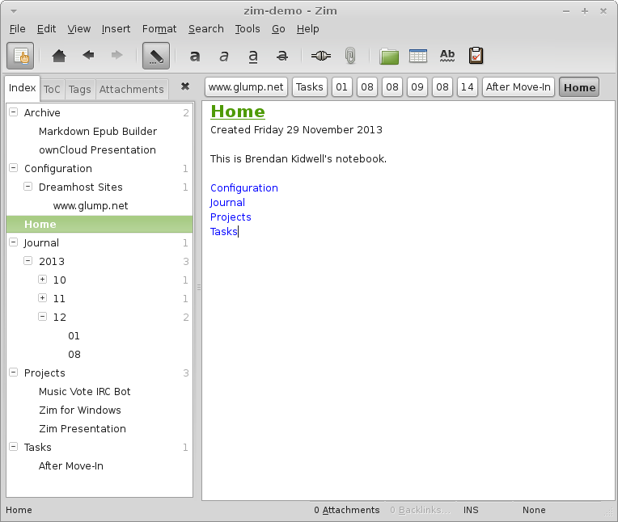
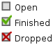
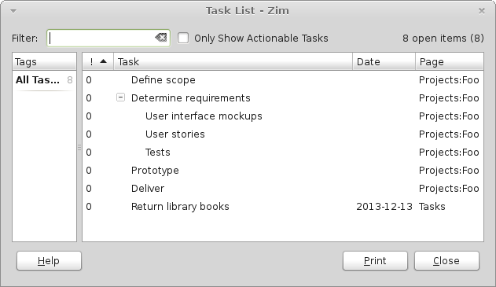
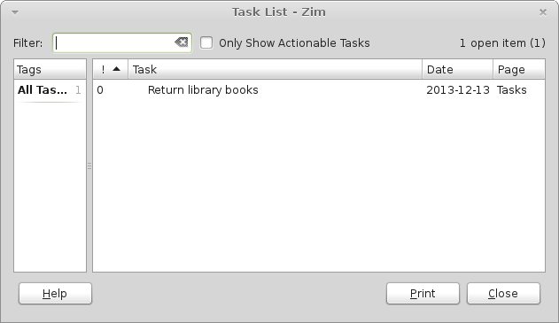
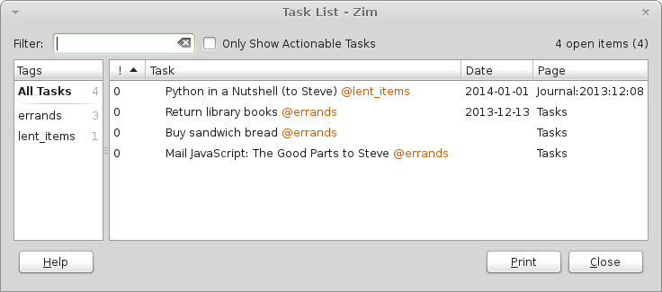
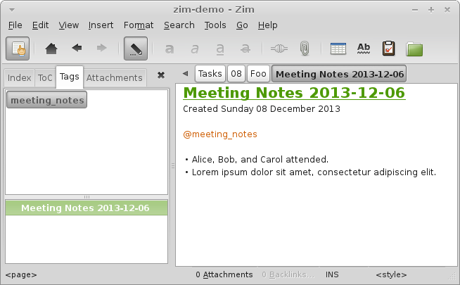

# Organizing Your Notes

Zim is a powerful tool for organizing your thoughts, plans, work notes ... pretty much anything that you would want to write down quickly without spending a lot of time formatting or polishing.

## Page Structure

In this section I will describe how *I* use Zim in my daily work. Everything here is only a suggestion to get you started. Zim tries to provide tools and without dictating how you structure your data.

Here is an approximation of what my own personal "Main" Zim Notebook looks like, simplified to show the overall structure:

\ 

Most of my notes go under the "Projects" page. Each project gets a Sub Page under "Projects", and if there are a lot of notes for a project, I'll make further Sub Pages under the project.

I use "Archive" as a graveyard for old projects that aren't needed active anymore. This keeps the list of Sub Pages under "Projects" reasonbly short, while I can still look at inactive projects elsewhere if I need to.

You can move Pages from one parent to another by dragging the Page within the Index and dropping it on top of its new parent Page, or by right-clicking in the Index and selecting Move Page. To promote a page to the root level, move to the point where you see a thin horizontal line appear between two root level pages, and drop it. When you move a Page, Zim automatically rewrites any links that point into this Page or its children.

"Configuration" is where I put notes about how I've set things up

"Tasks" are short-lived pages for things that are smaller than projects and won't be saved very long after they've been completed. For example, the "After Move-In" Page under "Tasks" might contain a LibreOffice spreadsheet (attachment) with a list of things I need buy and do to complete moving into my new apartment.

"Journal" is a catch-all for new bits of information. I have the Journal plugin enabled, which allows you to create a new page called "Journal:yyyy:mm:dd" with the keyboard shortcut ALT+D ("Go to Today"). Some example notes that might get recorded this way would include:

* "Received shirt as birthday gift from Mom"
* Ideas for a Project that may or may not ever get started
* Troubleshooting a computer problem

Eventually, you may trim down the Journal notes for some days --- deleting bits of data that are no longer needed or moving them to Projects or Tasks.

## Checkboxes and the Task List Plugin

When you write "[] ", Zim translates that to a checkbox widget. The checkbox has three states: Open, Finished, and Dropped.

Checkboxes can be indented so you can present one checkbox as being a part of a larger Task.

An example of using checkboxes would be for tracking pieces of a project, for example:

~~~
Foo Project

[] Define scope
[] Determine requirements
   [] User interface mockups
   [] User stories
   [] Tests
[] Prototype
[] Deliver
~~~

The Task List plugin takes the checkbox concept further. It maintains an index of every checkbox in the whole Notebook. Then you can use the View → Task List command to list all the Tasks that aren't marked Finished with a check mark or Dropped with an X mark.

You can apply due dates to checkbox Tasks by including the date in year-month-day format somewhere in the Task name, preceded by "d:" and enclosed in square brackets. If you had library books due on 13 December 2013 you would write:

~~~
[] Return library books [d:2013-12-13]
~~~

Now with those two above examples written in the Notebook, the Task List dialog box would look like this:

\ 

Now if you have a lot of project details in checkboxes as well as major "todo" items outside the scope of projects, you might want to configure Task List as I have, with the switch "Consider all checkboxes as tasks" turned off. You will find that in Edit → Preferences → Plugins → Task List → Configure.

Now you have to put "TODO" in each checkbox line that you want on the Task List, or on a line by itself before each list of Tasks. So, we would rewrite the "library books" Task like this:

~~~
TODO:
[] Return library books [d:2013-12-13]
~~~

\ 

## Tags

So far, we've covered finding information by brute force searching and simply finding it by its hierarchical Page name in the Index, and by viewing open Tasks in the Task List. Zim supports Tags as an alternative way to find and link data. You can use Tags to identify the context or grouping of Tasks.

After you enable the Tags plugin, you can put a tag anywhere in any page by typing "@" followed by letters, digits, and underscores.

Let's edit the "library books" Tasks on the Tasks page and add a few more to demonstrate:

~~~
TODO:
[] Return library books [d:2013-12-13] @errands
[] Buy sandwich bread @errands
[] Mail //JavaScript: The Good Parts// to Steve @errands
~~~

And we'll add another Task that's really a note to followup. Suppose today we lent *Python in a Nutshell* to Steve and we expect to get it back by next month. We could Go to Today (ALT+D) and write:

~~~
TODO:
[] //Python in a Nutshell// (to Steve) [d:2014-01-01] @lent_items
~~~

Remember, your Journal pages can be a catch-all for little notes like this that don't necessarily belong on other pages.

Now those four tasks look like this in the Task List:

\ 

You'll notice that the Tags pane in the left side of the Task List dialog box lets you filter the list to show only certain Tags.

For better clarity, you can also put tags at the top of a list in the introductory "TODO" line and they will apply to all Tasks in that particular list. You could rewrite the "errands" list like this:

~~~
TODO: @errands
[] Return library books [d:2013-12-13]
[] Buy sandwich bread
[] Mail //JavaScript: The Good Parts// to Steve
~~~

You can use Tags for other things than Tasks. For example, you could use a Tag to declare that a Page is a set of "meeting notes":

~~~
@meeting_notes

* Alice, Bob, and Carol attended.
* Lorem ipsum dolor sit amet, consectetur adipiscing elit.
~~~

After you've got a lot of Pages tagged like that, you can go to the Tags tab in the Index pane to see a list of all the tags anywhere in the Notebook. If click on a Tag in the list at the top, a list of Pages that include that Tag is shown.

\ 

## And More

There are more advanced options for the Tasks, Journal, and Tags plugin that aren't covered in this guide. Look at these plugins Preferences, and read the [Zim manual](http://zim-wiki.org/manual/Start.html) to get more organization ideas.

If you follow David Allen's famous [Getting Things Done](http://en.wikipedia.org/wiki/Getting_Things_Done) time management methodology, you will find a scheme for [implementing GTD in Zim](http://zim-wiki.org/manual/Usage/Getting_Things_Done.html), in the Zim manual.
