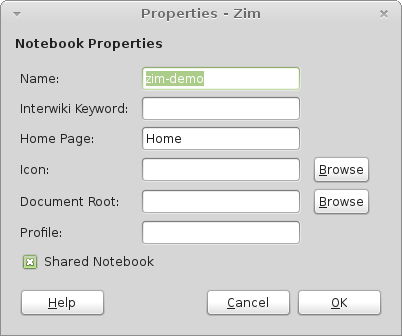
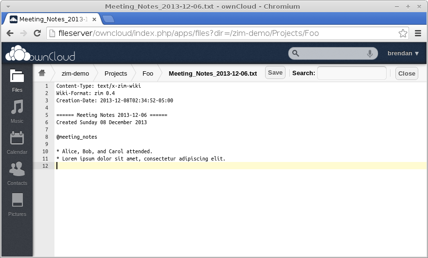

# Syncing Notebooks

If you're like me, you probably will want to work with your Zim notebooks across more than one computer. Since Zim stores all its primary data in plain text files and folders (with attachments stored in their native format), any file sharing strategy you would use for individual documents should work fine for a Zim notebook.

There are a few general approaches to file syncing:

* No syncing at all
  * Store the files on a portable device such as a USB thumbdrive and always use that device to access your files wherever you are.
  * Mount the shared files directly over the network using a protocol like Windows/Samba file sharing or SSH.
* Automatic syncing (Dropbox, ownCloud, Google Drive, etc.)
* Version control (Git, Mercurial, Subversion, etc.)

If you mount a shared folder over the network in order to avoid syncing, this only works well for local links. shared Notebooks mounted over the Internet will not work well with Zim because Zim has to open and read every file in the Notebook occasionally when certain actions trigger a refresh of the index.

The first step in setting up real syncing is enable "Shared" mode. Go to File → Properties and turn on the checkbox called "Shared Notebook".

\ 

This will move the index file and UI state file from `./.zim` under the Notebook folder to `~/.cache/zim/$NOTEBOOK-ID` (under your desktop profile folder). If you skip this step, your file sync process will unneccesarily copy extra data in those file which is constantly changing and is derived from your primary files anyway.

Do not forget to turn on "Shared" mode for **all Notebooks** you sync across computers!

## ownCloud Example

If you have your own personal server at home or at a hosting provider, [ownCloud](http://owncloud.org/) is one of the best ways to automatically sync files across more than one device. ownCloud is a free and open source web application that provides a space to store your files, and the project includes a [desktop file sync tool](http://owncloud.org/sync-clients/) that works just like proprietary tools like Dropbox and Google Drive.

Setting up an instance of ownCloud is beyond the scope of this guide, so I will assume you've already done that. See the [ownCloud manual](http://doc.owncloud.org/) for instructions.

If you haven't got your own personal server already, providing a space to store your Zim Notebooks is a great excuse to learn how to build one. You can a leftover desktop or laptop at home and configure your home router to pass incoming connections to the required ports on your server from the outside. Or you could go to a service like [prgmr.com](http://prgmr.com/xen/) and rent a virtual machine in a datacenter for a small monthyl fee.

Once you've got an ownCloud folder installed on your desktop (on each computer that will use it) all you have to do is move Zim Notebooks into that folder or create new Notebooks there.

The Open Another Notebook dialog box in Zim shows you the path to each notebook in the list. You can use your desktop's file manager to navigate to that path and move it to the ownCloud folder. Then back in the Open Notebook dialog box, you can remove the defunct path and Add the path to which you moved the Notebook.

ownCloud's desktop client automatically pushes new changes from your local machine to the central server immediately as you make the changes. It polls the central server for upstream changes from elsewhere in your sharing network once every 30 seconds.

One great side effect of storing your Notebooks in ownCloud is that now you can make small edits to edits to your Notebooks from any web browser! Zim stores Pages in plain text files, and if you navigate to one of those files in the ownCloud web interface, you get a text editor.

\ 

There are also non-FOSS [IOS and Android clients](http://owncloud.org/install/) (priced at $1) that let you edit files on your phone or tablet.

## Git Example

Using a version control tool like Git is a good alternative to automatic file sharing if you don't want to setup a complicated file sharing application and you also don't want to use a proprietary service. In fact, you might have a larger project under version control and you want to keep notes in a Zim Notebook in a subfolder of that project.

This section will show you how to setup a Git repository for a Zim Notebook on its own. I assume you have the `git` packages installed on your desktop and access to a Unix shell account somewhere where you can store your files.

### Create an Empty Repository

In Zim, use the Open Another Notebook to create and add a folder as a new Notebook. Turn on "Shared" mode and add some Pages.

In a Terminal, navigate to where you want to create your Notebook and create a repository.

~~~
$ cd ~/Notebooks/zim-git
$ rm -rf .zim # Make sure the cache files are gone
$ git init
Initialized empty Git repository in /home/brendan/Notebooks/zim-git/.git/
$ git add .
$ git commit -m "First commit"
[master (root-commit) 6268e32] First commit
 3 files changed, 28 insertions(+)
 create mode 100644 Home.txt
 create mode 100644 Page_2.txt
 create mode 100644 notebook.zim
~~~

Now push your new repository to the remote server.

~~~
$ ssh brendan@fileserver
$ mkdir -p ~/repos/zim-git.git
$ cd ~/repos/zim-git.git/
$ git init --bare
Initialized empty Git repository in /home/brendan/repos/zim-git.git/
$ exit
$ cd ~/Notebooks/zim-git
$ git push --set-upstream brendan@fileserver:repos/zim-git.git master
Counting objects: 5, done.
Delta compression using up to 3 threads.
Compressing objects: 100% (5/5), done.
Writing objects: 100% (5/5), 578 bytes, done.
Total 5 (delta 1), reused 0 (delta 0)
To brendan@fileserver:repos/zim-git.git
 * [new branch]      master -> master
Branch master set up to track remote branch master from brendan@fileserver:repos/zim-git.git.
~~~

Use your normal Git workflows to make commits and push and pull changes between your work computers and the central repository.

## Simple Backups

Depending on what you store in your Notebooks, it's a good idea to do regular backups of your data as well. As you can see from the syncing instructions above, backing up notebooks is simple: Just archive or copy the top-level folder of the Notebook (the one with the `notebook.zim` file in it).

To test your backup, restore it onto another computer or in another folder and open it in Zim or in a file manager and make sure all your data is there.

Take extra care if you habitually make Links from Zim pages to data somewhere else on your computer that you didn't copy **into** the Notebook. You will have to back up that data separately!
