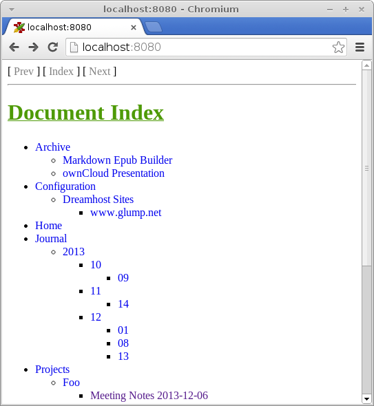
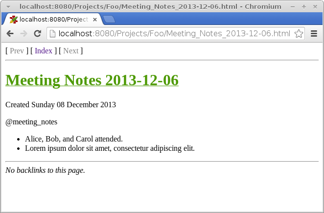

# Built-In Web Server

Zim has a built-in web server that you can use to provide a read-only view of your Notebook for a device you're not syncing with. To run it, open a Terminal and run Zim with the `--server` option and the path to your Notebook:

~~~
$ zim --server ~/Cloud/fileserver/zim-demo
~~~

Then open a browser and navigate to <http://localhost:8080> .

If you want to, you can even create a start/stop script for it and then add the start script to your `crontab` file.

You could run this script on a headless server to which you're already syncing your Notebooks.

## Start and Stop Script

Put this in `~/bin/zim-server.sh`. (Modify it to have the correct path to your Notebook.)

~~~
#!/bin/bash

NAME=Zim
CMD="zim --server ~/Cloud/fileserver/zim-demo/"
PID=""

function get_pid {
   PID=`ps -ef|grep "zim --server"|grep -v grep|awk '{ print $2}'`
}

function stop {
   get_pid
   if [ -z $PID ]; then
      echo "$NAME is not running."
      exit 1
   else
      kill $PID
      sleep 1
      echo "$NAME stopped."
   fi
}

function start {
   get_pid
   if [ -z $PID ]; then
      nohup $CMD >/dev/null 2>&1 &
      echo "$NAME started."
   else
      echo "$NAME is already running."
   fi
}

function restart {
   get_pid
   if [ -z $PID ]; then
      start
   else
      stop
      start
   fi
}

function status {
   get_pid
   if [ -z  $PID ]; then
      echo "$NAME is not running."
      exit 1
   else
      echo "$NAME is running."
   fi
}

case "$1" in
   start)
      start
   ;;
   stop)
      stop
   ;;
   restart)
      restart
   ;;
   status)
      status
   ;;
   *)
      echo "Usage: $0 {start|stop|restart|status}"
esac
~~~

Then make it executable.

~~~
$ chmod +x ~/bin/zim-server.sh
~~~

Now you can run those scripts to start and stop Zim from the Terminal using `zim-server.sh start` and `zim-server.sh stop`, but you don't have to keep the Terminal open.

## Installing in Crontab

If you want the Zim web server to start automatically when you reboot, run

~~~
$ crontab -e
~~~

and add this to the end of the file and save it. (Be sure to put your username in after `/home/`.)

~~~
@reboot /home/brendan/bin/zim-server.sh start
~~~
